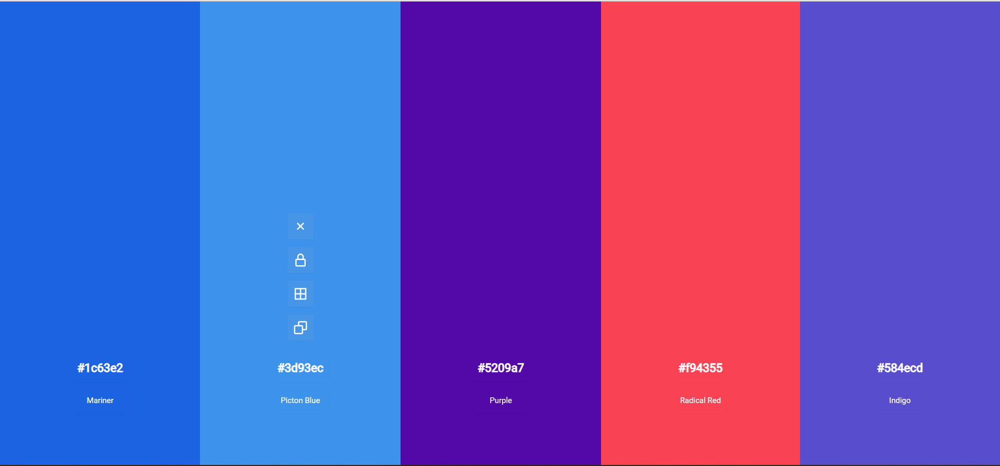
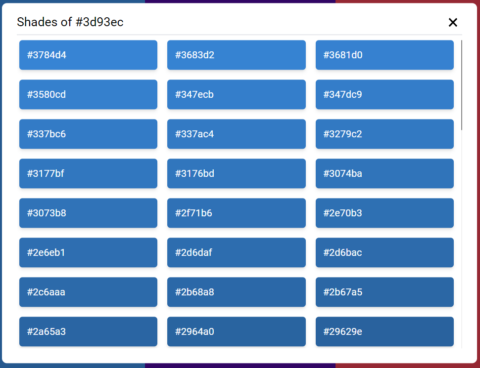
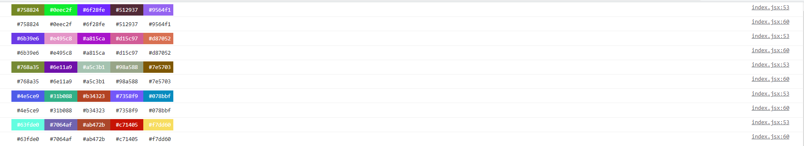

# Colors app clone

### UI

### Generate shades of selected color

### Logs colors on terminal as well

### Features

- Hit spacebar to generate new colors.
- Remove a color.
- Lock a color, which will not change on new generation.
